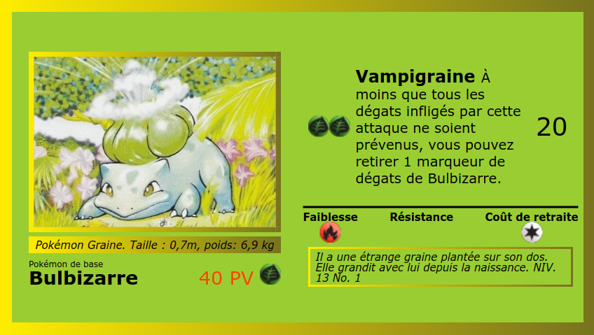

# Modern responsive part 1 : flexbox

## Entraînement

Pour se familiariser avec les différentes propriétés :
[Flexbox Froggy](https://flexboxfroggy.com/#fr)

## TP : à vous !

Le but de l'exercice est de reproduire une célèbre carte à jouer en utilisant les propriétés flexbox. Voici le modèle :


### Étape 0 : Configuration VSCode

- Créer un fork de ce repository
- Installer le plugin _Prettier_
  - Dans les options :
    - Cocher "Format on save"
    - Régler "Default formatter" sur "...prettier..."
  - Vérifier le bon fonctionnement sur les fichiers HTML et CSS (à la sauvegarde, le code est-il reformaté ?)
- Installer le plugin _Live Server_
  - Vérifier qu'un fichier HTML peut-être ouvert avec le bouton "Go Live" en bas à droite (auto-refresh du navigateur)

### Étape 1 : Les fondations (HTML sauce BEM)

- Rappel BEM : [ici](https://www.alticreation.com/bem-pour-le-css/) (français) ou [là](https://css-tricks.com/bem-101/)
- Déterminer quels sont les blocs constituant la carte (une demi-douzaine, selon le choix de découpage), et leur donner un nom simple
- Écrire le HTML correspondant, sans CSS pour le moment
  - Les images sont dans le dossier `src/assets/img`

Résultat approximatif à cette étape :


Attention à vérifier la présence de la balise _meta viewport_ pour un bon dimensionnement sur mobile !

```
<meta name="viewport" content="width=device-width, initial-scale=1.0" />
```

- Solliciter une vérification de ma part, attendre la correction ou continuer si tout se passe bien !
- `git commit` avant de passer à la suite

### Étape 2 : Découper le HTML avec pug

Pug est un langage de templating HTML. Un de ses atouts principaux est de permettre l'inclusion de templates HTML dans d'autres.

Cela permet par exemple de ne pas répéter le header et le footer à chaque page d'un site.

Ici, cela va nous permettre de découper notre page en plusieurs fichiers .pug, un pour chaque bloc.

- Afin de pouvoir utiliser Pug :
  - Dans le dossier de travail, transformer votre projet simple en projet npm avec `npm init`
  - Installer [parcel](https://parceljs.org/) avec `npm install parcel --save-dev`
  - Dans `package.json`, ajouter un script `"serve": "parcel index.pug"`
  - Lancer `npm run serve`. Parcel _build_ votre site et l'ouvre dans le navigateur, sur _localhost_.
- Changer l'extension de votre fichier `index.html` pour `index.pug`.
- Déplacer chaque bloc BEM dans son propre fichier pug, dans un dossier dédié (nommé par exemple `src/includes`). Il y aura donc autant de fichiers pug que de blocs BEM.
- En vous inspirant de la [documentation](https://pugjs.org/language/includes.html), modifier votre code pour inclure les différents fichiers créés dans `index.pug`.

_Note : le mot clé `include` de pug fonctionne même si le reste du code reste au format HTML classique. Pas besoin de tout ré-écrire._

### Étape 3 : Styling SCSS

- Ajouter un fichier `styles.scss` à votre projet et l'importer à partir de l'index. Parcel s'occupera de la transformation en CSS.
- Ajouter un fichier `reset.scss` à votre projet contenant le [reset CSS classique](https://meyerweb.com/eric/tools/css/reset/), sans l'importer dans l'index.
- Dans le fichier `styles.scss`, utiliser un import SASS pour importer le fichier `reset.scss`.

Dans vos projets, toujours inclure les deux règles CSS suivantes (rappel sur [box-sizing](https://developer.mozilla.org/fr/docs/Web/CSS/box-sizing)) :

```
* {
  box-sizing: border-box;
}

img {
  max-width: 100%;
}
```

Propriétés "interdites" (car inutiles) pour cet exercice :

- `width`
- `height`
- `float`
- `position`
- `transform`

Votre but est maintenant de reproduire la carte sur un écran de type iPhone5 (320\*568). Il vous appartient de pousser la ressemblance avec l'original au maximum, mais voici un exemple :


- En accord avec la convention BEM :
  - Utilisez quasiment exclusivement des sélecteurs de classe
  - Évitez au maximum les imbrications. SASS sera utile, mais surtout pour la suite.
- Solliciter une vérification de ma part, attendre la correction ou continuer si tout se passe bien !
- `git commit` avant de passer à la suite

### Étape 4 : Mode paysage

On souhaite adapter la carte à un mobile de la même taille en mode paysage (568\*320), autrement dit lorsque la largeur est plus grande que la hauteur.
Pour ce faire, vous pouvez ajouter une mixin SASS en début de fichier :

```
@mixin landscape {
  @media (min-aspect-ratio: 1/1) {
    @content;
  }
}
```

Grâce à cette mixin, vous pouvez écrire :

```
.selector {
  color: red;

  @include landscape {
    color: blue;
  }
}
```

Cela permet d'inclure les variations au plus proche du sélecteur de base, au lieu de tout écrire en fin de fichier, ce qui rend le code plus maintenable / lisible.

Voici le nouvel objectif à atteindre :



- Solliciter une vérification de ma part ou attendre la correction
- `git commit` pour finir

### Étape 5 : Rendu

Rendez votre travail en créant une pull request de votre repository de travail vers ce repository.
Indiquez votre nom dans le titre ou commentaire de la PR.

# Ressources

- En cas de besoin : [Exercices HTML/CSS](https://htmlcss2018.netlify.com/)
- [Méthode BEM](http://getbem.com/introduction/)
- [Pug](https://pugjs.org)

## Flexbox

- Reférence : [CSS Tricks Guide](https://css-tricks.com/snippets/css/a-guide-to-flexbox/)
- Outil : [Flexulator, calculateur de flexbox](https://www.flexulator.com/)
- Entraînement : [Flexbox Froggy](https://flexboxfroggy.com/#fr)
